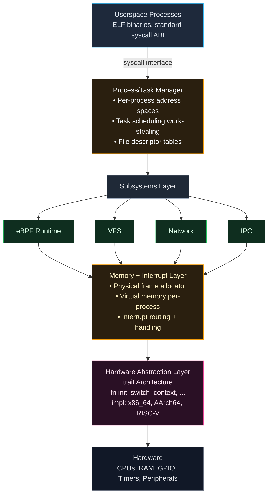
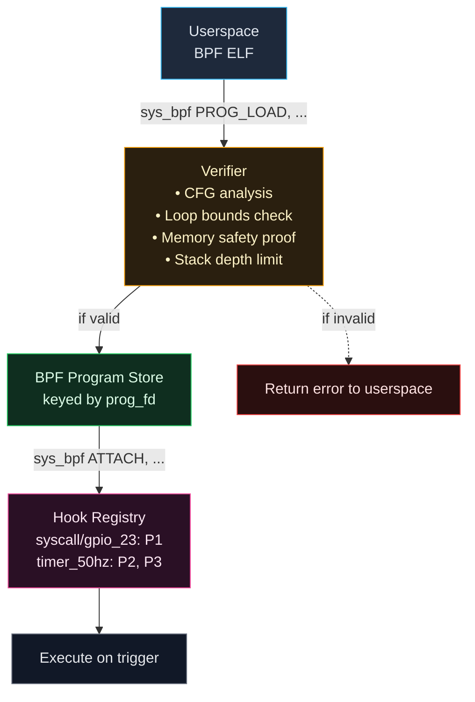

# Axiom

A bare-metal Rust kernel with runtime-programmable behavior through verified eBPF programs.

Axiom targets robotics and embedded systems where kernel logic must evolve without reflashing firmware. Instead of recompiling to change kernel behavior, verified programs are loaded and attached to kernel hooks at runtime.

**Repository structure:**
- `kernel/` — core kernel implementation
- `userspace/` — userspace programs and libraries
- `bpf/` — eBPF runtime and verifier
- `drivers/` — hardware drivers (VirtIO, RPi5, etc.)
- `build/` — build system and tooling

---

## Why Axiom Exists

**Problem:** Embedded systems deployed in the field need behavioral updates—new sensor fusion algorithms, modified control loops, updated safety policies. Traditional kernels require full reflash cycles, which are:
- Risky in production environments
- Slow (minutes of downtime)
- Wasteful (megabytes to change kilobytes)
- Dangerous (bricked devices on failed updates)

**Solution:** Runtime kernel extension through eBPF. Programs are:
- Verified for safety before execution
- Hot-loaded without reboot
- Attached to kernel hooks (syscalls, timers, GPIO, PWM, IIO)
- Detachable on-the-fly

This is proven in Linux (where eBPF is used for tracing, networking, security), but Linux is unsuitable for hard real-time robotics due to unpredictable latency and resource overhead.

---

## Core Design Decisions

### 1. Bare Metal (No Host OS)

Axiom boots directly on hardware with no underlying OS:
- No Linux, no RTOS, no firmware runtime
- Limine bootloader (x86_64) or device tree (AArch64)
- Full control of CPU, memory, interrupts

**Tradeoff analysis:**

| Approach | Latency | Footprint | Control | Complexity |
|----------|---------|-----------|---------|------------|
| Linux + eBPF | 10-100μs jitter | ~50MB | Limited | Lower |
| RTOS + custom | <10μs | ~1MB | Partial | Medium |
| Bare metal | <1μs deterministic | ~500KB | Total | Higher |

For robotics with sub-millisecond control loops, bare metal is required.

---

### 2. Rust Core (`no_std`)

The kernel is ~95% Rust, `no_std`, with `panic=abort`:
- Memory safety enforced by ownership/borrowing
- Explicit `unsafe` boundaries (documented and audited)
- Zero-cost abstractions
- Assembly limited to boot stubs and exception vectors

**What this prevents:**
```rust
// Prevented at compile time:
let ptr = allocate_buffer();
free(ptr);
use(ptr);  // ❌ use-after-free caught by borrow checker

// Prevented by explicit unsafe:
fn modify_page_table(ptr: *mut PageTable) {
    unsafe {  // Forced to acknowledge danger
        (*ptr).entries[0] = new_entry;
    }
}
```

**Why not C:** C relies on programmer discipline. Rust encodes invariants in the type system. In kernel context, this eliminates entire bug classes (use-after-free, double-free, iterator invalidation, data races).

---

### 3. eBPF for Runtime Extension

eBPF programs extend kernel behavior without kernel recompilation:

**Example: Custom GPIO interrupt handler**
```c
// Loaded at runtime, verified, then attached to GPIO line 23
BPF_PROG(gpio_handler, struct gpio_event *event) {
    if (event->line == 23 && event->rising_edge) {
        sys_wake_task(PID_MOTOR_CONTROLLER);
        metrics.gpio_triggers++;
    }
    return 0;
}
```

**Verification guarantees:**
- Bounded execution (no infinite loops)
- Constrained stack usage (512 bytes)
- Validated memory access (no arbitrary pointers)
- Termination proof (static analysis of control flow)

**Execution paths:**
- **Interpreter:** Portable, ~50ns overhead per instruction (x86_64)
- **JIT:** Native code generation, <5ns overhead (AArch64)

**Profile selection:**
```rust
// Compile-time selection via sealed traits
#[cfg(feature = "embedded")]
type BpfProfile = profiles::Embedded;  // 512B stack, interpreter only

#[cfg(feature = "cloud")]
type BpfProfile = profiles::Cloud;  // 4KB stack, JIT enabled
```

---

## Architecture



**Monolithic justification:** Microkernel IPC overhead (100-1000ns per message) is unacceptable for control loops. Monolithic structure with Rust trait boundaries provides modularity without performance cost.

---

## Execution Model

### Process vs Task Separation

```rust
struct Process {
    pid: Pid,
    address_space: VirtualAddressSpace,
    file_table: FileDescriptorTable,
    tasks: Vec<TaskId>,  // Multiple execution contexts
}

struct Task {
    tid: TaskId,
    registers: SavedContext,
    stack: VirtualAddress,
    parent_process: Pid,
}
```

**Why separate:** Traditional UNIX model conflates resource container (process) with execution context (thread). Separation simplifies:
- Multithreading (multiple tasks, one address space)
- Migration (move task to different CPU without moving process)
- Resource accounting (process-level, not per-thread)

### Scheduler

**Per-CPU run queues with work stealing:**
```
CPU 0: [T1, T4, T7]
CPU 1: [T2, T5]     ← steals T7 from CPU 0 if idle
CPU 2: [T3, T6, T8]
```

**Preemption:** Timer interrupts (1ms quantum, configurable)
**Cooperation:** `sched_yield()` syscall

**Priority inversion handling:** Priority inheritance protocol (task inherits priority of highest-priority waiter).

---

## Syscall Flow

```
1. Userspace executes syscall instruction
2. CPU switches to kernel mode → arch handler
3. Context saved (registers, stack pointer)
4. Syscall number dispatched
   ├─→ BPF pre-hook runs (if attached)
   ├─→ Syscall handler executes
   └─→ BPF post-hook runs (if attached)
5. Return value written to register
6. Context restored → return to userspace
```

**Error convention:** Negative return values are `-errno`:
```rust
// In kernel:
if allocation_failed {
    return -ENOMEM;  // -12
}

// In userspace:
int fd = open("/dev/null", O_RDONLY);
if (fd < 0) {
    // fd == -ENOENT (-2) if file not found
}
```

**Supported syscalls:** `read`, `write`, `open`, `close`, `fork`, `exec`, `wait`, `sched_yield`, `bpf`, `ioctl`, ...

---

## eBPF Deep Dive

### Program Lifecycle



### Verification Algorithm

**Control Flow Graph Construction:**
```rust
fn verify_program(bytecode: &[u8]) -> Result<(), VerifyError> {
    let cfg = build_cfg(bytecode)?;
    
    // 1. Ensure all paths terminate (no infinite loops)
    for node in cfg.nodes() {
        if has_backedge(node) && !has_bounded_iteration(node) {
            return Err(VerifyError::UnboundedLoop);
        }
    }
    
    // 2. Check stack depth on all paths
    let max_depth = cfg.compute_max_stack_depth();
    if max_depth > STACK_LIMIT {
        return Err(VerifyError::StackOverflow);
    }
    
    // 3. Validate memory access
    for instr in cfg.instructions() {
        if let MemoryAccess { addr, size } = instr {
            if !is_valid_access(addr, size) {
                return Err(VerifyError::InvalidMemory);
            }
        }
    }
    
    Ok(())
}
```

### Attach Points

| Hook | Trigger | Use Case |
|------|---------|----------|
| `SYSCALL_ENTER` | Before syscall handler | Audit, policy enforcement |
| `SYSCALL_EXIT` | After syscall handler | Monitoring, stats |
| `TIMER_<freq>` | Periodic timer tick | Control loops, sampling |
| `GPIO_<line>` | GPIO interrupt | Event-driven responses |
| `PWM_CYCLE` | PWM period complete | Motor control feedback |
| `IIO_SAMPLE` | Sensor data ready | Sensor fusion pipelines |

---

## Memory Management

### Physical Memory

**Frame allocator:** Bitmap-based, O(1) allocation:
```rust
struct FrameAllocator {
    bitmap: [u64; NUM_FRAMES / 64],  // 1 bit per 4KB frame
    next_free: AtomicUsize,
}

impl FrameAllocator {
    fn alloc(&mut self) -> Option<PhysicalFrame> {
        // Find first zero bit, set it, return frame
    }
}
```

### Virtual Memory

**Per-process address spaces:**
```
Userspace:   0x0000_0000_0000 - 0x0000_7FFF_FFFF (128GB)
Kernel:      0xFFFF_8000_0000 - 0xFFFF_FFFF_FFFF (higher half)
```

**Page table structure (4-level on x86_64):**
```
PML4 → PDPT → PD → PT → 4KB page
```

**TLB shootdown:** Cross-CPU invalidation via IPI when unmapping shared pages.

### Kernel Heap

**Allocator:** Linked-list (first-fit), 16-byte alignment:
```rust
#[global_allocator]
static ALLOCATOR: LockedHeap = LockedHeap::empty();

// Usage:
let buf = Box::new([0u8; 1024]);  // Allocated from kernel heap
```

---

## Hardware Abstraction

**Portability via traits:**
```rust
trait Architecture {
    fn early_init();
    fn enable_interrupts();
    fn disable_interrupts();
    fn context_switch(old: &mut Context, new: &Context);
    fn halt() -> !;
}

// Per-arch implementations:
impl Architecture for x86_64::X86_64 { ... }
impl Architecture for aarch64::AArch64 { ... }
impl Architecture for riscv::RiscV64 { ... }
```

**Conditional compilation:**
```rust
#[cfg(target_arch = "x86_64")]
fn handle_interrupt(vector: u8) {
    apic::send_eoi();
}

#[cfg(target_arch = "aarch64")]
fn handle_interrupt(irq: u32) {
    gic::write_eoir(irq);
}
```

---

## Supported Platforms

### x86_64
- **Bootloader:** Limine (UEFI + BIOS)
- **Interrupt controller:** APIC (xAPIC/x2APIC)
- **Timer:** APIC timer + TSC
- **Devices:** VirtIO (block, net, console)
- **Testing:** QEMU, VMware, bare metal

### AArch64
- **Targets:** QEMU virt, Raspberry Pi 5
- **Interrupt controller:** GICv2/v3
- **Timer:** ARM Generic Timer
- **Devices:**
  - VirtIO (QEMU)
  - RP1 peripherals (Pi 5): GPIO, UART, PWM, SPI, I2C
- **Boot:** Device tree

### RISC-V
- **Status:** Experimental
- **Target:** QEMU virt only
- **Interrupt controller:** PLIC
- **Limitations:** No eBPF JIT, basic drivers

---

## Filesystem

**Root filesystem:** ext2, built at compile-time
```bash
# Build system generates ext2 image with userspace programs
scripts/make-rootfs.sh
→ rootfs.ext2 (embedded in kernel or loaded from storage)
```

**VFS layer:**
```rust
trait Filesystem {
    fn open(&self, path: &Path) -> Result<FileHandle>;
    fn read(&self, handle: FileHandle, buf: &mut [u8]) -> Result<usize>;
    // ...
}

impl Filesystem for Ext2 { ... }
impl Filesystem for TmpFS { ... }  // Future
```

**Mount points:**
```
/ → ext2 (root)
/dev → DevFS (devices)
/proc → ProcFS (planned)
```

---

## Build System

**Requirements:**
- Rust nightly (2024-01-01 or later)
- `cargo`
- QEMU (for testing)
- cross-compilation targets

**Quick start:**
```bash
# Install targets
rustup target add x86_64-unknown-none
rustup target add aarch64-unknown-none

# Build and run in QEMU
cargo run  # Defaults to x86_64

# Architecture-specific
cargo run --target x86_64-unknown-none
cargo run --target aarch64-unknown-none
```

**Raspberry Pi 5:**
```bash
# Build kernel + devicetree
./scripts/build-rpi5.sh
→ output: kernel8.img, bcm2712-rpi-5-b.dtb

# Deploy to SD card (requires formatted card)
./scripts/deploy-rpi5.sh /dev/sdX

# Boot process:
# 1. GPU firmware loads kernel8.img
# 2. Kernel parses DTB for hardware config
# 3. Initializes RP1 peripherals
# 4. Boots to userspace
```

**Debug build:**
```bash
cargo build --target x86_64-unknown-none
qemu-system-x86_64 -kernel target/.../axiom -s -S  # Wait for GDB
gdb target/.../axiom
(gdb) target remote :1234
(gdb) break kmain
(gdb) continue
```

---

## Current Implementation Status

**Core kernel:**
- [x] Boot (x86_64, AArch64)
- [x] Virtual memory + paging
- [x] Interrupt handling (APIC, GIC)
- [x] Task scheduling (preemptive + cooperative)
- [x] Syscall interface
- [x] Physical memory allocation
- [x] Kernel heap

**Subsystems:**
- [x] eBPF runtime (interpreter + JIT on AArch64)
- [x] eBPF verifier (CFG, bounds, safety)
- [x] VFS abstraction
- [x] ext2 driver (read-only)
- [x] Process/task separation

**Hardware:**
- [x] VirtIO (block, network, console)
- [x] RPi5 GPIO (RP1 controller)
- [x] RPi5 UART (PL011)
- [x] RPi5 PWM
- [ ] USB (planned)
- [ ] DMA (partial)

**Userspace:**
- [x] Basic C library (syscall wrappers)
- [x] Shell (`/bin/sh`)
- [x] Utilities (`ls`, `cat`, `echo`)
- [ ] POSIX compatibility (partial)

**RISC-V:**
- [x] Boot on QEMU virt
- [ ] SMP support
- [ ] eBPF JIT
- [ ] Real hardware testing

---

## Design Philosophy

Axiom is **not**:
- A production kernel (yet)
- POSIX-compliant (by design)
- A Linux replacement

Axiom **is**:
- A research platform for runtime kernel extension
- An exploration of Rust's viability for systems programming
- A testbed for verified runtime behavior modification

**Key questions being explored:**
1. Can eBPF verification provide sufficient safety for kernel extensions?
2. Does Rust's type system meaningfully reduce kernel bugs in practice?
3. What's the performance overhead of safe abstractions in bare-metal contexts?
4. How minimal can a usable kernel be while supporting dynamic behavior?

---

## Contributing

This is experimental research code. Contributions welcome, especially:
- Architecture ports (ARM Cortex-M, RISC-V extensions)
- Driver implementations (USB, DMA, network)
- eBPF optimizations (JIT improvements, verifier enhancements)
- Userspace POSIX compatibility

**Code standards:**
- All `unsafe` blocks must have safety comments
- Public APIs need documentation
- Tests for verifiable components
- Benchmark critical paths

---

## License

Dual-licensed under MIT and Apache 2.0.

## Author

Utkarsh Maurya  
GitHub: https://github.com/pro-utkarshM  
Email: utkarsh@kernex.sbs

---

**Further reading:**
- `docs/bpf.md` — eBPF internals and verification details
- `docs/scheduler.md` — Task scheduling algorithm and work-stealing
- `docs/memory.md` — Memory management and allocator design
- `docs/porting.md` — How to port to new architectures
