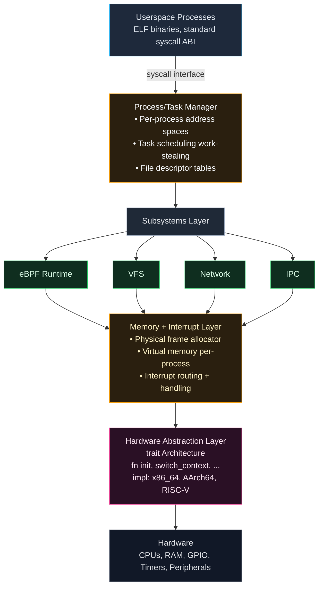
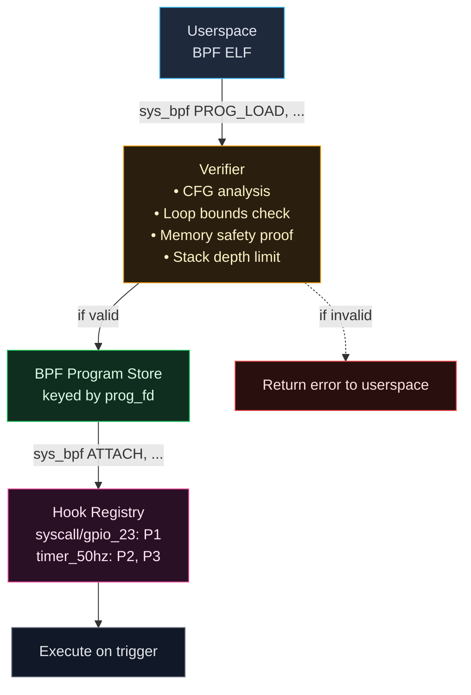

# Axiom

A bare-metal Rust kernel with runtime-programmable behavior through verified eBPF programs.

Axiom targets robotics and embedded systems where kernel logic must evolve without reflashing firmware. Instead of recompiling to change kernel behavior, verified programs are loaded and attached to kernel hooks at runtime.

**Repository structure:**
- `kernel/src` — core kernel implementation
- `kernel/crates` — modular kernel subsystems (BPF, VFS, etc.)
- `userspace/` — userspace programs and libraries
- `scripts/` — build system and deployment tools
- `docs/` — architectural documentation and benchmarks or you can visit [docs](https://deepwiki.com/pro-utkarshM/axiom-ebpf)

---

## Why Axiom Exists

**Problem:** Embedded systems deployed in the field need behavioral updates—new sensor fusion algorithms, modified control loops, updated safety policies. Traditional kernels require full reflash cycles, which are:
- Risky in production environments
- Slow (minutes of downtime)
- Wasteful (megabytes to change kilobytes)
- Dangerous (bricked devices on failed updates)

**Solution:** Runtime kernel extension through eBPF. Programs are:
- Verified for safety before execution
- Hot-loaded without reboot
- Attached to kernel hooks (syscalls, timers, GPIO, PWM, IIO)
- Detachable on-the-fly

This is proven in Linux (where eBPF is used for tracing, networking, security), but Linux is unsuitable for hard real-time robotics due to unpredictable latency and resource overhead.

---

## Core Design Decisions

### 1. Bare Metal (No Host OS)

Axiom boots directly on hardware with no underlying OS:
- No Linux, no RTOS, no firmware runtime
- Limine bootloader (x86_64) or device tree (AArch64)
- Full control of CPU, memory, interrupts

**Tradeoff analysis:**

| Approach | Latency | Footprint | Control | Complexity |
|----------|---------|-----------|---------|------------|
| Linux + eBPF | ~2,000ns jitter | ~60MB (kernel) | Limited | Lower |
| RTOS + custom | <10,000ns | ~1MB | Partial | Medium |
| **Axiom (Pi5)** | **211ns (fixed)** | **~22MB** | **Total** | **Higher** |

For robotics with sub-millisecond control loops, bare metal is required. See [docs/benchmarks.md](docs/benchmarks.md) for detailed hardware measurements.

---

### 2. Rust Core (`no_std`)

The kernel is ~95% Rust, `no_std`, with `panic=abort`:
- Memory safety enforced by ownership/borrowing
- Explicit `unsafe` boundaries (documented and audited)
- Zero-cost abstractions
- Assembly limited to boot stubs and exception vectors

**What this prevents:**
```rust
// Prevented at compile time:
let ptr = allocate_buffer();
free(ptr);
use(ptr);  // ❌ use-after-free caught by borrow checker

// Prevented by explicit unsafe:
fn modify_page_table(ptr: *mut PageTable) {
    unsafe {  // Forced to acknowledge danger
        (*ptr).entries[0] = new_entry;
    }
}
```

**Why not C:** C relies on programmer discipline. Rust encodes invariants in the type system. In kernel context, this eliminates entire bug classes (use-after-free, double-free, iterator invalidation, data races).

---

### 3. eBPF for Runtime Extension

eBPF programs extend kernel behavior without kernel recompilation:

**Example: Custom GPIO interrupt handler**
```c
// Loaded at runtime, verified, then attached to GPIO line 23
BPF_PROG(gpio_handler, struct gpio_event *event) {
    if (event->line == 23 && event->rising_edge) {
        sys_wake_task(PID_MOTOR_CONTROLLER);
        metrics.gpio_triggers++;
    }
    return 0;
}
```

**Verification guarantees:**
- Bounded execution (no infinite loops)
- Constrained stack usage (up to 512KB depending on profile)
- Validated memory access (no arbitrary pointers)
- Termination proof (static analysis of control flow)

**Execution paths:**
- **Interpreter:** Portable, ~50ns overhead per instruction (x86_64)
- **JIT:** Native code generation, <5ns overhead (AArch64)

**Profile selection:**
```rust
// Compile-time selection via sealed traits
#[cfg(feature = "embedded-profile")]
type BpfProfile = profile::EmbeddedProfile;  // 8KB stack, interpreter only

#[cfg(feature = "cloud-profile")]
type BpfProfile = profile::CloudProfile;  // 512KB stack, JIT enabled
```

---

## Architecture


```mermaid
graph TB
    User[Userspace Processes<br/>ELF binaries, standard syscall ABI]
    
    User -->|syscall interface| PTM[Process/Task Manager<br/>• Per-process address spaces<br/>• Task scheduling work-stealing<br/>• File descriptor tables]
    
    PTM --> Sub[Subsystems Layer]
    
    Sub --> BPF[eBPF Runtime]
    Sub --> VFS[VFS]
    Sub --> Net[Network]
    Sub --> IPC[IPC]
    
    BPF --> Mem
    VFS --> Mem
    Net --> Mem
    IPC --> Mem
    
    Mem[Memory + Interrupt Layer<br/>• Physical frame allocator<br/>• Virtual memory per-process<br/>• Interrupt routing + handling]
    
    Mem --> HAL[Hardware Abstraction Layer<br/>trait Architecture<br/>fn init, switch_context, ...<br/>impl: x86_64, AArch64, RISC-V]
    
    HAL --> HW[Hardware<br/>CPUs, RAM, GPIO, Timers, Peripherals]

    %% Dark theme styling
    style User fill:#1e293b,stroke:#38bdf8,color:#e2e8f0
    style PTM fill:#2a1f0f,stroke:#f59e0b,color:#f8fafc
    style Sub fill:#1f2937,stroke:#94a3b8,color:#e5e7eb
    style BPF fill:#0f2e1f,stroke:#22c55e,color:#dcfce7
    style VFS fill:#0f2e1f,stroke:#22c55e,color:#dcfce7
    style Net fill:#0f2e1f,stroke:#22c55e,color:#dcfce7
    style IPC fill:#0f2e1f,stroke:#22c55e,color:#dcfce7
    style Mem fill:#2a1f0f,stroke:#f59e0b,color:#fef3c7
    style HAL fill:#2a1025,stroke:#ec4899,color:#fce7f3
    style HW fill:#111827,stroke:#6b7280,color:#e5e7eb
```

**Monolithic justification:** Microkernel IPC overhead (100-1000ns per message) is unacceptable for control loops. Monolithic structure with Rust trait boundaries provides modularity without performance cost.

---

## Execution Model

### Process vs Task Separation

```rust
struct Process {
    pid: ProcessId,
    name: String,
    address_space: RwLock<Option<AddressSpace>>,
    file_descriptors: RwLock<BTreeMap<FdNum, FileDescriptor>>,
    // Tasks reference the process via Arc<Process>
}

struct Task {
    tid: TaskId,
    process: Arc<Process>,
    last_stack_ptr: Pin<Box<usize>>,
    kstack: Option<HigherHalfStack>,
    ustack: RwLock<Option<LowerHalfAllocation<Writable>>>,
}
```

**Why separate:** Traditional UNIX model conflates resource container (process) with execution context (thread). Separation simplifies:
- Multithreading (multiple tasks referencing one process)
- Resource accounting (process-level, not per-thread)
- Memory isolation (tasks within a process share an address space)

### Scheduler

**Global run queue:**
The current implementation uses a single global MPSC (Multiple Producer, Single Consumer) queue for task scheduling across all CPUs.

```
Global Queue: [T1, T4, T7, T2, T5, T3, T6, T8]
CPU 0: Pop → T1
CPU 1: Pop → T4
CPU 2: Pop → T7
```

**Preemption:** Timer interrupts (1ms quantum, configurable via APIC/GIC)
**Cooperation:** `sched_yield()` syscall

**Priority inversion handling:** Priority inheritance protocol (planned).

---

## Syscall Flow

```
1. Userspace executes syscall instruction
2. CPU switches to kernel mode → arch handler
3. Context saved (registers, stack pointer)
4. Syscall number dispatched
   ├─→ BPF pre-hook runs (if attached)
   ├─→ Syscall handler executes
   └─→ BPF post-hook runs (if attached)
5. Return value written to register
6. Context restored → return to userspace
```

**Error convention:** Negative return values are `-errno`:
```rust
// In kernel:
if allocation_failed {
    return -ENOMEM;  // -12
}

// In userspace:
int fd = open("/dev/null", O_RDONLY);
if (fd < 0) {
    // fd == -ENOENT (-2) if file not found
}
```

**Supported syscalls:** `read`, `write`, `open`, `close`, `fork`, `exec`, `wait`, `sched_yield`, `bpf`, `ioctl`, ...

---

## eBPF Deep Dive

### Program Lifecycle


```mermaid
graph TD
    User[Userspace<br/>BPF ELF]
    
    User -->|sys_bpf PROG_LOAD, ...| Verifier[Verifier<br/>• CFG analysis<br/>• Loop bounds check<br/>• Memory safety proof<br/>• Stack depth limit]
    
    Verifier -->|if valid| Store[BPF Program Store<br/>keyed by prog_fd]
    
    Verifier -.->|if invalid| Reject[Return error to userspace]
    
    Store -->|sys_bpf ATTACH, ...| Registry[Hook Registry<br/>syscall/gpio_23: P1<br/>timer_50hz: P2, P3]
    
    Registry --> Execute[Execute on trigger]

    %% Dark theme styling (aligned with previous diagram)
    style User fill:#1e293b,stroke:#38bdf8,color:#e2e8f0
    style Verifier fill:#2a1f0f,stroke:#f59e0b,color:#fef3c7
    style Store fill:#0f2e1f,stroke:#22c55e,color:#dcfce7
    style Registry fill:#2a1025,stroke:#ec4899,color:#fce7f3
    style Execute fill:#111827,stroke:#6b7280,color:#e5e7eb
    style Reject fill:#2a0f0f,stroke:#ef4444,color:#fee2e2
```

### Verification Algorithm

**Control Flow Graph Construction:**
```rust
fn verify_program(bytecode: &[u8]) -> Result<(), VerifyError> {
    let cfg = build_cfg(bytecode)?;
    
    // 1. Ensure all paths terminate (no infinite loops)
    for node in cfg.nodes() {
        if has_backedge(node) && !has_bounded_iteration(node) {
            return Err(VerifyError::UnboundedLoop);
        }
    }
    
    // 2. Check stack depth on all paths
    let max_depth = cfg.compute_max_stack_depth();
    if max_depth > STACK_LIMIT {
        return Err(VerifyError::StackOverflow);
    }
    
    // 3. Validate memory access
    for instr in cfg.instructions() {
        if let MemoryAccess { addr, size } = instr {
            if !is_valid_access(addr, size) {
                return Err(VerifyError::InvalidMemory);
            }
        }
    }
    
    Ok(())
}
```

### Attach Points

| Hook | Trigger | Use Case |
|------|---------|----------|
| `SYSCALL_ENTER` | Before syscall handler | Audit, policy enforcement |
| `SYSCALL_EXIT` | After syscall handler | Monitoring, stats |
| `TIMER_<freq>` | Periodic timer tick | Control loops, sampling |
| `GPIO_<line>` | GPIO interrupt | Event-driven responses |
| `PWM_CYCLE` | PWM period complete | Motor control feedback |
| `IIO_SAMPLE` | Sensor data ready | Sensor fusion pipelines |

---

## Memory Management

### Physical Memory

**Frame allocator:** Sparse state-based tracking with `first_free` optimization.

```rust
pub struct PhysicalMemoryManager {
    regions: Vec<MemoryRegion>,
    first_free: Option<RegionFrameIndex>,
}

#[derive(Debug, Copy, Clone, Eq, PartialEq)]
pub enum FrameState {
    Unusable,
    Allocated,
    Free,
}
```

- **Stage 1:** Early bump allocator for boot-time structures.
- **Stage 2:** Sparse manager tracking usable RAM regions.
- **Optimization:** `first_free` pointer reduces search latency for free frames.

### Virtual Memory

**Per-process address spaces:**
```
Userspace:   0x0000_0000_0000 - 0x0000_7FFF_FFFF_FFFF (128TB on x86_64)
Kernel:      0xFFFF_8000_0000 - 0xFFFF_FFFF_FFFF (higher half)
```

**Page table structure (4-level on x86_64):**
```
PML4 → PDPT → PD → PT → 4KB page
```

**TLB shootdown:** Cross-CPU invalidation via IPI (Inter-Processor Interrupts).

### Kernel Heap

**Allocator:** `linked-list-allocator` (first-fit), with dynamic sizing based on available RAM.

```rust
#[global_allocator]
static ALLOCATOR: LockedHeap = LockedHeap::empty();

// Allocated from kernel heap:
let buf = Box::new([0u8; 1024]); 
```

---

## Hardware Abstraction

**Portability via traits:**
```rust
pub trait Architecture {
    fn early_init();
    fn init();
    fn enable_interrupts();
    fn disable_interrupts();
    fn are_interrupts_enabled() -> bool;
    fn wait_for_interrupt();
    fn shutdown() -> !;
    fn reboot() -> !;
}

// Per-arch implementations:
impl Architecture for aarch64::Aarch64 { ... }
impl Architecture for riscv64::Riscv64 { ... }
```

**Conditional compilation:**
```rust
#[cfg(target_arch = "x86_64")]
fn handle_interrupt(vector: u8) {
    apic::send_eoi();
}

#[cfg(target_arch = "aarch64")]
fn handle_interrupt(irq: u32) {
    gic::write_eoir(irq);
}
```

---

## Supported Platforms

### x86_64
- **Bootloader:** Limine (UEFI + BIOS)
- **Interrupt controller:** APIC (xAPIC/x2APIC)
- **Timer:** APIC timer + TSC
- **Devices:** VirtIO (block, net, console)
- **Testing:** QEMU, VMware, bare metal

### AArch64
- **Targets:** QEMU virt, Raspberry Pi 5
- **Interrupt controller:** GICv2/v3
- **Timer:** ARM Generic Timer
- **Devices:**
  - VirtIO (QEMU)
  - RP1 peripherals (Pi 5): GPIO, UART, PWM
- **Boot:** Device tree

### RISC-V
- **Status:** Minimal Boot Only
- **Target:** QEMU virt
- **Current Support:** Logging, dummy allocator
- **Planned:** MMU, PLIC, scheduler, JIT

---

## Filesystem

**Root filesystem:** ext2, built and embedded during compilation.
```bash
# Build system embeds the rootfs image into the kernel binary
./scripts/build-rpi5.sh
→ kernel8.img (includes embedded ext2 rootfs)
```

**VFS layer:**
```rust
trait FileSystem {
    fn open(&mut self, path: &AbsolutePath) -> Result<FsHandle, OpenError>;
    fn read(&mut self, handle: FsHandle, buf: &mut [u8], offset: usize) -> Result<usize, ReadError>;
    // ...
}

impl FileSystem for VirtualExt2Fs { ... }
```

**Mount points:**
```
/ → ext2 (root)
/dev → DevFS (devices)
```

---

## Build System

**Requirements:**
- Rust nightly
- `cargo`
- QEMU (for testing)
- cross-compilation targets (`x86_64-unknown-none`, `aarch64-unknown-none`)

**Quick start:**
```bash
# Build and run in QEMU (x86_64)
cargo run

# RPi5 Build
./scripts/build-rpi5.sh
```

---

## Current Implementation Status

**Core kernel:**
- [x] Boot (x86_64, AArch64)
- [x] Virtual memory + paging
- [x] Interrupt handling (APIC, GIC)
- [x] Task scheduling (preemptive + cooperative)
- [x] Syscall interface
- [x] Physical memory allocation
- [x] Kernel heap

**Subsystems:**
- [x] eBPF runtime (interpreter + JIT on AArch64)
- [x] eBPF verifier (CFG, bounds, safety)
- [x] VFS abstraction
- [x] ext2 driver (read-only)
- [x] Process/task separation

**Hardware:**
- [x] VirtIO (block, network, console)
- [x] RPi5 GPIO (RP1 controller)
- [x] RPi5 UART (PL011)
- [x] RPi5 PWM
- [ ] RPi5 SPI / I2C (planned)
- [ ] USB (planned)
- [ ] DMA (partial)

**Userspace:**
- [x] Basic syscall wrappers
- [x] Shell (`/bin/sh`)
- [x] Utilities (`ls`, `cat`, `echo`)
- [ ] POSIX compatibility (partial)

**RISC-V:**
- [x] Boot on QEMU virt
- [ ] MMU + Paging
- [ ] SMP support
- [ ] eBPF JIT
- [ ] Real hardware testing

---

## Design Philosophy

Axiom is **not**:
- A production kernel (yet)
- POSIX-compliant (by design)
- A Linux replacement

Axiom **is**:
- A research platform for runtime kernel extension
- An exploration of Rust's viability for systems programming
- A testbed for verified runtime behavior modification

**Key questions being explored:**
1. Can eBPF verification provide sufficient safety for kernel extensions?
2. Does Rust's type system meaningfully reduce kernel bugs in practice?
3. What's the performance overhead of safe abstractions in bare-metal contexts?
4. How minimal can a usable kernel be while supporting dynamic behavior?

---

## Contributing

This is experimental research code. Contributions welcome, especially:
- Architecture ports (ARM Cortex-M, RISC-V extensions)
- Driver implementations (USB, DMA, network)
- eBPF optimizations (JIT improvements, verifier enhancements)
- Userspace POSIX compatibility

**Code standards:**
- All `unsafe` blocks must have safety comments
- Public APIs need documentation
- Tests for verifiable components
- Benchmark critical paths

---

## License

Triple-licensed under MIT, Apache 2.0, and MPL 2.0.

## Author

Utkarsh Maurya  
GitHub: https://github.com/pro-utkarshM  
Email: utkarsh@kernex.sbs

---

**Further reading:**
- `docs/benchmarks.md` — Authoritative hardware benchmarks (Pi5) and Linux comparison
- `kernel/crates/kernel_bpf/docs/ARCHITECTURE.md` — eBPF runtime architecture
- `kernel/crates/kernel_bpf/docs/SCHEDULING.md` — eBPF program scheduling
- `kernel/crates/kernel_bpf/docs/VERIFICATION.md` — BPF verification algorithm
- `kernel/crates/kernel_bpf/docs/PROFILES.md` — BPF physical reality profiles
