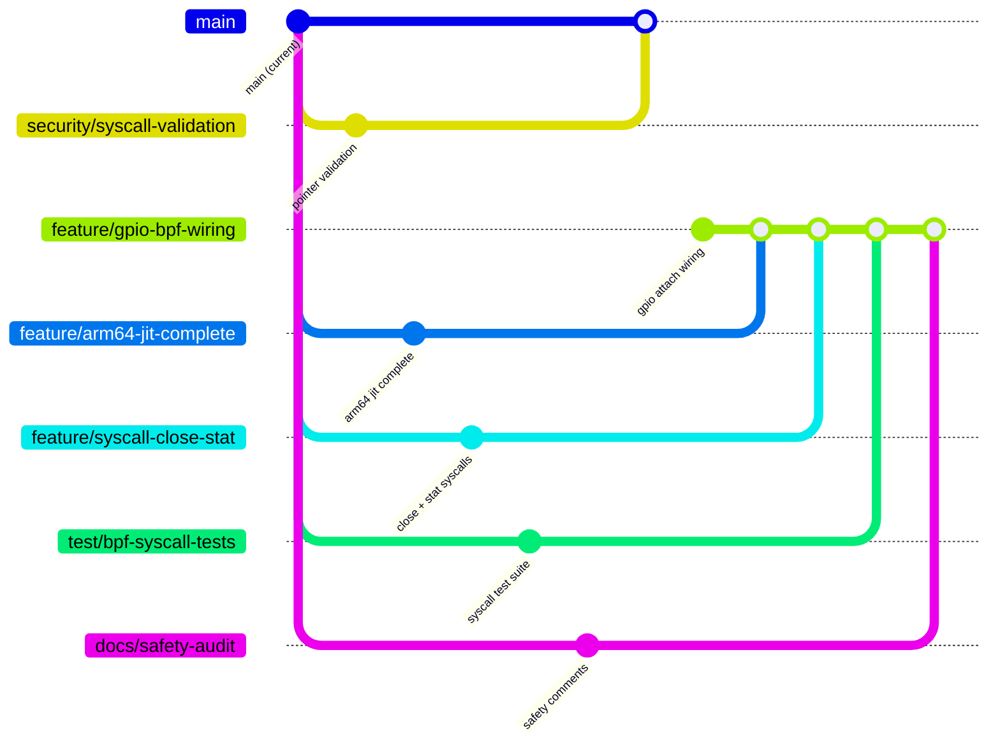

# Axiom-eBPF Parallel Work Branch Plan

**Created:** 2026-01-28  
**Base Branch:** `main`  
**Strategy:** Feature branches that merge independently back to main

---

## Branch Overview

---

## Parallel Branches

### 1. `security/syscall-validation` — CRITICAL ✅ DO NOT USE (MERGED)
**Owner:** Agent A  
**Status:** Merged to main (2026-01-28)
**Priority:** P0  
**Est. Effort:** 2 weeks  
**Dependencies:** None (independent)

**Scope:**
- Add pointer validation layer for all syscall handlers
- Validate address space (user vs kernel)
- Add alignment and bounds checking
- Focus on [bpf.rs](file:///home/utkarsh/Work/axiom-ebpf/kernel/src/syscall/bpf.rs)

**Files to modify:**
- `kernel/src/syscall/bpf.rs` — lines 22, 54, 88, 123, 150, 177
- `kernel/src/syscall/mod.rs` — validation helper functions
- New: `kernel/src/syscall/validation.rs`

**Merge criteria:**
- All user pointers validated before use
- No raw pointer casts without validation
- CI passes

---

### 2. `feature/gpio-bpf-wiring` — HIGH
**Owner:** Agent B  
**Priority:** P1  
**Est. Effort:** 1-2 weeks  
**Dependencies:** None (independent)

**Scope:**
- Wire BPF `GpioAttach` to existing RPi5 GPIO driver
- Implement interrupt-based BPF program execution
- Enable: button press → BPF program → LED toggle

**Files to modify:**
- `kernel/crates/kernel_bpf/src/attach/gpio.rs` — implement real attach
- `kernel/src/arch/aarch64/platform/rpi5/gpio.rs` — add BPF callback registration
- `kernel/src/bpf/mod.rs` — wire gpio attach type

**Merge criteria:**
- BPF program can attach to GPIO pin
- GPIO interrupt triggers BPF execution
- Demo: button → BPF → LED works on RPi5

---

### 2b. `feature/bpf-helpers` — HIGH
**Owner:** Agent B2  
**Priority:** P1  
**Est. Effort:** 1 week  
**Dependencies:** None (independent)

**Scope:**
- Implement BPF helper functions in kernel context
- `bpf_ktime_get_ns()` — kernel time
- `bpf_trace_printk()` — debug output to serial
- `bpf_map_lookup_elem()`, `bpf_map_update_elem()`, `bpf_map_delete_elem()`
- `bpf_ringbuf_output()` — event output

**Files to modify:**
- New: `kernel/src/bpf/helpers.rs` — helper implementations
- `kernel/crates/kernel_bpf/src/execution/interpreter.rs` — wire helper dispatch

**Merge criteria:**
- All core helpers implemented and callable from BPF programs
- `bpf_trace_printk` output visible on serial console
- Map operations work from BPF context

---

### 3. `feature/arm64-jit-complete` — HIGH
**Owner:** Agent C  
**Priority:** P1  
**Est. Effort:** 2 weeks  
**Dependencies:** None (BPF crate is self-contained)

**Scope:**
- Complete ARM64 JIT instruction emission (~40% → 100%)
- Fix hardcoded 512-byte stack (compute from program analysis)
- Add ARM64 JIT tests

**Files to modify:**
- `kernel/crates/kernel_bpf/src/execution/jit_aarch64.rs` — complete emission
- `kernel/crates/kernel_bpf/src/execution/jit_aarch64.rs:634` — fix stack size
- `kernel/crates/kernel_bpf/tests/` — ARM64 JIT tests

**Merge criteria:**
- All BPF instructions emit correct ARM64
- JIT benchmarks pass
- Stack size computed dynamically

---

### 4. `feature/syscall-close-stat` — MEDIUM
**Owner:** Agent D  
**Priority:** P2  
**Est. Effort:** 1 week  
**Dependencies:** None (syscall layer is independent)

**Scope:**
- Implement `SYS_CLOSE` syscall (critical gap)
- Implement `SYS_STAT` / `SYS_FSTAT` syscalls
- Implement `SYS_LSEEK` syscall

**Files to modify:**
- `kernel/crates/kernel_abi/src/syscall.rs` — add syscall numbers
- `kernel/crates/kernel_syscall/src/` — handlers
- `kernel/src/syscall/mod.rs` — dispatch

**Merge criteria:**
- `close()`, `stat()`, `fstat()`, `lseek()` work
- Userspace file operations complete
- CI passes

---

### 5. `test/bpf-syscall-tests` — MEDIUM
**Owner:** Agent E  
**Priority:** P2  
**Est. Effort:** 2 weeks  
**Dependencies:** Can start immediately, may need rebases

**Scope:**
- Add unit tests for `kernel/src/syscall/bpf.rs`
- Test all BPF_PROG_LOAD, MAP_*, ATTACH operations
- Test error paths and edge cases

**Files to modify:**
- New: `kernel/src/syscall/bpf_tests.rs` — unit tests
- `kernel/crates/kernel_bpf/tests/` — integration tests

**Merge criteria:**
- All BPF syscall operations tested
- Error paths covered
- Miri passes

---

### 6. `docs/safety-audit` — MEDIUM
**Owner:** Agent F  
**Priority:** P2  
**Est. Effort:** 1 week  
**Dependencies:** None (docs only)

**Scope:**
- Add SAFETY comments to all 70+ unsafe blocks
- Document invariants and assumptions
- Fix `edition = "2024"` typo in Cargo.toml

**Files to modify:**
- `kernel/src/syscall/*.rs` — SAFETY comments
- `kernel/src/arch/**/*.rs` — SAFETY comments
- `Cargo.toml`, `kernel/Cargo.toml` — fix edition

**Merge criteria:**
- All unsafe blocks documented
- No undocumented unsafe code
- `cargo clippy` clean

---

## Dependency Matrix

| Branch | Depends On | Blocks |
|--------|------------|--------|
| security/syscall-validation | — | test/bpf-syscall-tests (soft) |
| feature/gpio-bpf-wiring | — | — |
| feature/arm64-jit-complete | — | — |
| feature/syscall-close-stat | — | — |
| test/bpf-syscall-tests | — | — |
| docs/safety-audit | — | — |

> All branches are independent and can be merged in any order.

---

## Merge Order (Recommended)

1. **`docs/safety-audit`** — Low risk, quick win
2. **`security/syscall-validation`** — Critical security fixes
3. **`feature/syscall-close-stat`** — Foundational syscalls
4. **`feature/gpio-bpf-wiring`** — Key feature
5. **`feature/arm64-jit-complete`** — Platform completeness
6. **`test/bpf-syscall-tests`** — Tests (may need rebases)

---

## Post-Merge Phase 2 Branches

After all Phase 1 branches merge, these can start:

### `feature/pwm-driver`
- Scope: PWM hardware driver + BPF wiring
- Depends on: `feature/gpio-bpf-wiring` patterns

### `feature/iio-sensors`
- Scope: IIO sensor subsystem + BPF wiring
- Depends on: `feature/gpio-bpf-wiring` patterns  

### `feature/kprobe-tracepoint`
- Scope: Kernel instrumentation infrastructure
- Depends on: `security/syscall-validation`

---

## Agent Assignment Suggestions

| Agent | Branch | Skill Focus |
|-------|--------|-------------|
| Agent A | security/syscall-validation | Kernel security, memory safety |
| Agent B | feature/gpio-bpf-wiring | ARM64, embedded, RPi5 |
| Agent C | feature/arm64-jit-complete | Compiler, ARM64 ISA |
| Agent D | feature/syscall-close-stat | Syscall layer, VFS |
| Agent E | test/bpf-syscall-tests | Testing, CI |
| Agent F | docs/safety-audit | Documentation, Rust safety |

---

## CI Requirements

Each branch must:
1. Pass `cargo build --target x86_64-unknown-none`
2. Pass `cargo build --target aarch64-unknown-none`
3. Pass `cargo test` (host tests)
4. Pass `cargo miri test` (undefined behavior check)
5. Pass `cargo clippy`

---

*Plan created: 2026-01-28*
